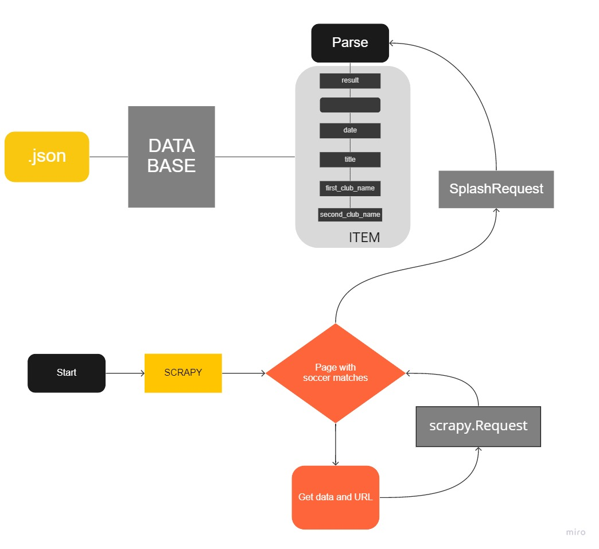
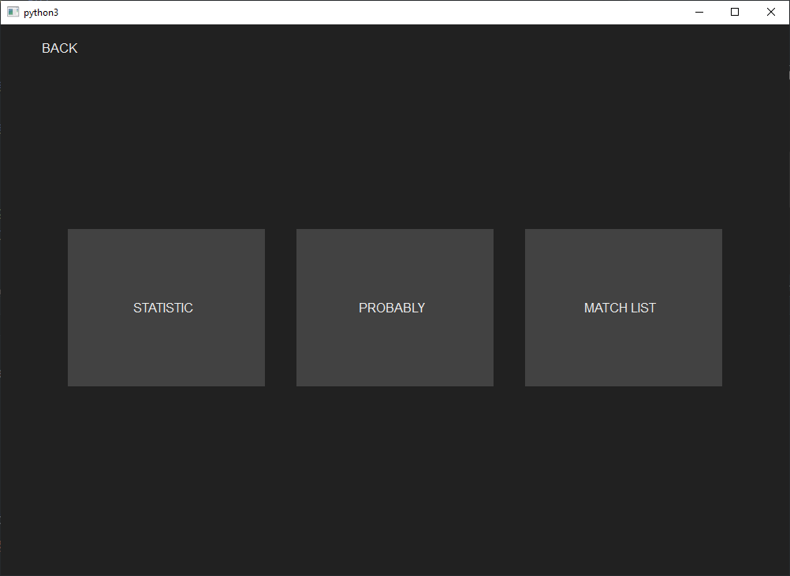
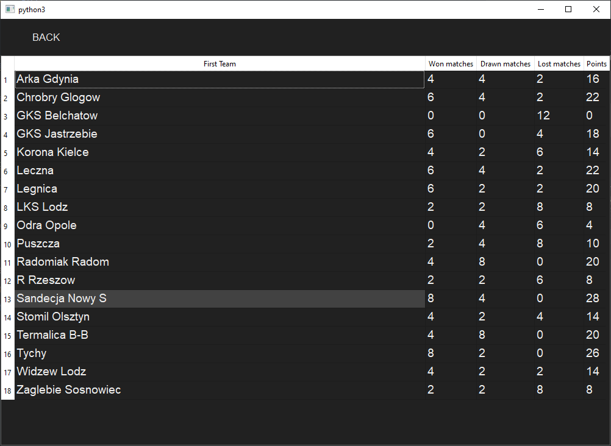
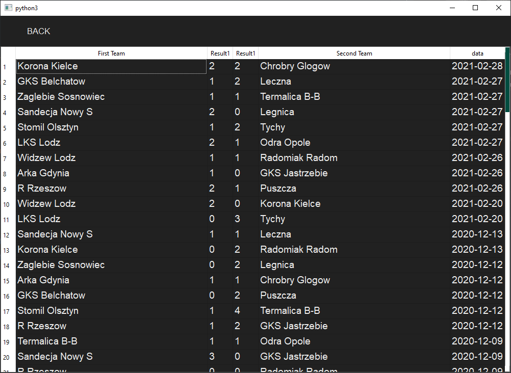
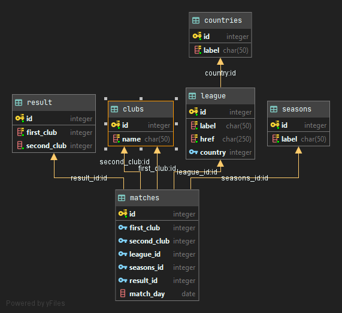

# Soccer Analysing

## 1. Opis

Projekt jest napisany przy wykorzystaniu standardowych modułów 'Python 3.8', a konkretnie przy wykorzystaniu modułu '
Anaconda' (lub [Python Virtual Environment](venv/Scripts/python.exe)) oraz Docker dla parsowania stron dynamicznych,
postawienia bazy danych.

---
## 2. Rozdziały

* [1. Opis](#1-opis)
* [2. Jak postawić/włączyć projekt?](#3-jak-postawiwczy-projekt)
* [4. Scraping](#4-scraping)
    * [4.1 Pliki](#41-pliki)
    * [4.2 Jak działa?](#42jak-dziaa)
    * [4.3 Wyniki Parsingu](#43wyniki-parsingu)
* [5. Graphical user interface (GUI)](#5-graphical-user-interface-gui)
* [5.1 Interfejs](#51-interfejs)
* [6. Fuzzy Logic](#6-fuzzy-logic)
* [7. Struktura bazy danych](#7-struktura-bazy-danych)

---
## 3. Jak postawić/włączyć projekt??
W tym celu jedynie jest potrzebny [zaintalowany docker](https://docs.docker.com/docker-for-windows/install/)  
oraz wpisanie następującej komendy w terminalu:

```commandline
docker-compose.yml run -d
```

Następnie niezbędnym będzie zainstalowanie wszystkich zewnętrznych python bibliotek.
Dla uruchomienia pobierania pakietów jedynie trzeba skorzystać z poniższego polecenia.

```commandline
pip install -r requirements.txt
```
Start odpowiednich modułów obmywa się zgodnie z:
```commandline
 python main.py [-h] [--parsing] [--gui]

List the options:

optional arguments:
  -h, --help  show this help message and exit
  --parsing   Starts the page parsing (https://www.oddsportal.com)
  --gui       Opens the project gui
```

---

## 4. Scraping
Start scrapingu odbywa się za pomocą polecenia:
```commandline
scrapy runspider soccer/spiders/scraping.py -o data.json --loglevel=ERROR  --loglevel=INFO
```
lub
```commandline
python main.py --scrapy
```
Użycie flag ``--loglevel=ERROR`` (w pierwszym przykadzie) powoduje, że w terminalu 
zostaną wyświetlane tylko błędy oraz flaka ``-o`` wskazuje na plik, w który zostaną zapisane zebrane dane.


### 4.1 Pliki

* [soccer/scraping.py](soccer/soccer/spiders/scraping.py): główny plik scrapingu;
* [soccer/items.py](soccer/soccer/items.py): SoccerItem class;
* [soccer/spiders/Scraping.py](soccer/soccer/spiders/scraping.py): SoccerPipeline class, lączenie i zapis danych do database;

### 4.2 Jak działa?

1. Pobiera strony internetowe dla poszczególnych Państw;
2. Z pobranych stron wyszukuje informacje o prowadzonych w nich ligach;
3. Wysyła Request dla lig/sezonów/stron;
4. Jeśli strona nie posiada danych o meczach przejść do 2, jeśli posiada to 5;
5. Wyślij do parsera;
6. Zapisz dane do objektu Item;
7. Wyślij i zapisz w bazie danych;



### 4.3 Wyniki Parsingu

| #  | Opis                       |        |
|:---|:---------------------------|:-------|
| 1  | Liczba meczów              | 121916 |
| 2  | Liczba przerobionych stron | 1432   |
| 3  | Liczba blędów              | 1      |
---

## 5. Graphical user interface (GUI)
Po zainstalowaniu  i urochomieniu wszystkich wymienionych modułów z [podpunktu 3](#3-jak-postawiwczy-projekt),
wystarczy jedynie wpisać następujące polecenie dodają flagę  ``--gui``:
```commandline
python main.py --gui
```

### 5.1 Interfejs
|  |      |
|:---|:---  |
|   |      |

## 6. Fuzzy Logic
Dla określenia prawdopodowieństwa wykorzystuję logikę rozmytą oraz bibliotekę
``skfuzzy``.

Dla tego biorę następujące danę:
* (_advancement_number_team_) statystyka zdobywanych goli w odpowiednym turnieju
  (czym więcej tym mniejsze prawdopodobieństwo zajścia remisu)
* (_goals_statistics_) Wyniki drużyny w aktualnym sezonie;
* (_lost_numer_team_) Procent remisów do wrzystkich meczów w przeciągu 5 lat

```python 
rules = [
    ctrl.Rule(self.advancement_first_team['good'] | self.advancement_second_team['good'], self.remiss['good']),
    ctrl.Rule(self.advancement_first_team['poor'] | self.advancement_second_team['good'], self.remiss['poor']),
    ctrl.Rule(self.advancement_first_team['good'] | self.advancement_second_team['poor'], self.remiss['poor']),
    ctrl.Rule(self.advancement_first_team['average'] | self.advancement_second_team['average'] |
              self.goals_statistics['good'], self.remiss['good']),
    ctrl.Rule(self.advancement_first_team['average'] | self.advancement_second_team['average'] |
              self.goals_statistics['poor'], self.remiss['poor']),

    ctrl.Rule(self.advancement_first_team['good'] | self.lost_second_team['average'] |
              self.advancement_second_team['average'], self.remiss['good']),
    ctrl.Rule(self.advancement_first_team['average'] | self.lost_first_team['average'] |
              self.advancement_second_team['good'], self.remiss['good']),

]
```
### Przykładowe wyniki


---

## 7. Struktura bazy danych
